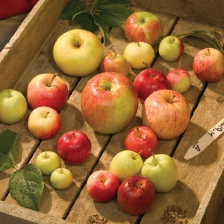

# prography_5th_dl
프로그라피 5기 딥러닝 파트 사전과제입니다.  
This is pre-task project for Deep Learning part of Prography


## 1. 주제 Subject
주제는 냉장고에서 오브젝트를 찾는 것입니다.  
Find the object in the refrigerator!

## 2. 데이터셋 Dataset
제공하는 데이터셋은 다음과 같이 구성되어있다.

```
sub-test-annotations-bbox.csv
sub-train-annotations-bbox.csv
sub-vaildation-annotations-bbox.csv
>test
>train
>vaildation

```
각각의 csv파일은 ImageID	XMin	XMax	YMin	YMax	ClassName 이 5개의 column으로 이루어져 있다.  
컬럼의 이름으로 보건데 이 프로젝트에서 데잍터로 활용될 값은   XMin	XMax	YMin	YMax	0부터 1사이의 값이다.  
그래서 예시를 한번 보았다. 아래 표는 sub-test-annotations-bbox.csv중 일부이다.  

| ImageID| 	XMin| 	XMax| 	YMin| 	YMax| 	ClassName| 
| :------| :--: | :---: | :----:| :----:| ----------:| 
|apple_0068.xml	|0.35714285714285700	|0.625|	0.3125|	0.6071428571428570|	apple|
|apple_0068.xml	|0.5491071428571430	|0.7098214285714290|	0.5669642857142860|	0.7142857142857140|	apple|
|apple_0068.xml	|0.6339285714285710	|0.84375|	0.39285714285714300|	0.6160714285714290|	apple|
|apple_0068.xml	|0.8482142857142860	|1.0|	0.1875|	0.375	|apple|
|apple_0068.xml	|0.7455357142857140	|0.8705357142857140|	0.30357142857142900|	0.4017857142857140|	apple|
|apple_0068.xml	|0.5982142857142860	|0.7455357142857140	|0.29910714285714300	|0.45089285714285700|	apple|
|apple_0068.xml	|0.7008928571428570	|0.8214285714285710	|0.14732142857142900|	0.26785714285714300|	apple|
|apple_0068.xml	|0.5446428571428570	|0.7276785714285710|	0.05803571428571430	|0.21428571428571400|	apple|
|apple_0068.xml	|0.5491071428571430	|0.6875|	0.1875|	0.3080357142857140	|apple|
|apple_0068.xml	|0.4419642857142860	|0.59375|	0.23214285714285700	|0.34375	|apple|
|apple_0068.xml	|0.23214285714285700|	0.45982142857142900|	0.12946428571428600	|0.33035714285714300	|apple|
|apple_0068.xml	|0.11160714285714300|	0.3125|	0.32589285714285700|	0.5044642857142860	|apple|
|apple_0068.xml	|0.11607142857142900|	0.2767857142857140|	0.4642857142857140	|0.6160714285714290	|apple|
|apple_0068.xml	|0.25|	0.41517857142857100|	0.5669642857142860	|0.7366071428571430|	apple|
|apple_0068.xml	|0.38839285714285700|	0.53125	|0.7544642857142860	|0.8973214285714290	|apple|
|apple_0068.xml	|0.5133928571428570|	0.7008928571428570|	0.7857142857142860	|0.9508928571428570	|apple|
|apple_0068.xml	|0.4955357142857140|	0.6428571428571430|	0.6651785714285710	|0.8125	|apple|
|apple_0068.xml	|0.6294642857142860|	0.8080357142857140|	0.6830357142857140	|0.8660714285714290|	apple|
|apple_0068.xml	|0.21428571428571400|	0.32589285714285700	|0.7455357142857140|0.8571428571428570	|apple|
|apple_0068.xml	|0.15625|	0.26339285714285700|	0.6696428571428570|	0.7857142857142860|	apple|
|apple_0068.xml	|0.004464285714285710|	0.12053571428571400	|0.39285714285714300|	0.5535714285714290|	apple|

위의 ImageID를 보면 같은 파일임이 분명한데도 여러개의 다른 데이터들이 있는 것을 발견할 수 있다. 그래서 이미지를 확인해 보았다.  
  

이미지를 보면 한 이미지에 여러 개의 사과가 있는 것을 알 수 있다. 따라서 위의 값들은 오브젝트의 위치를 포착하는 상대적 좌표로 유추 해볼 수 있다.  


